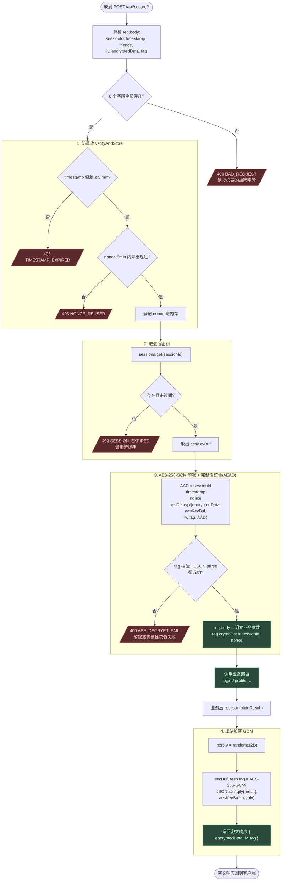
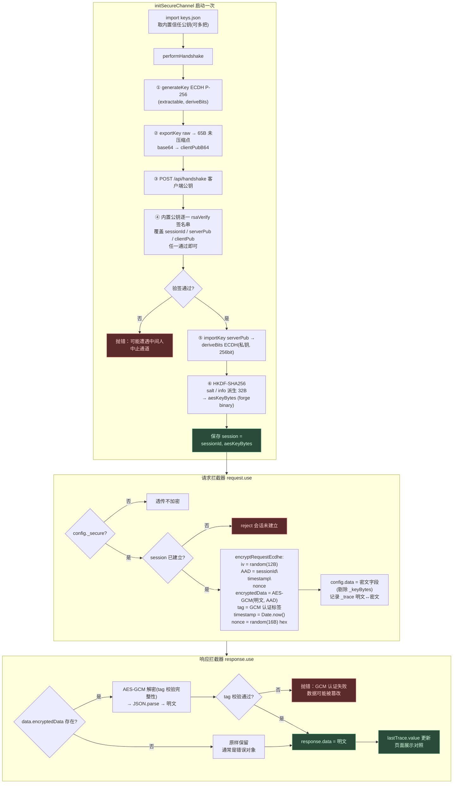
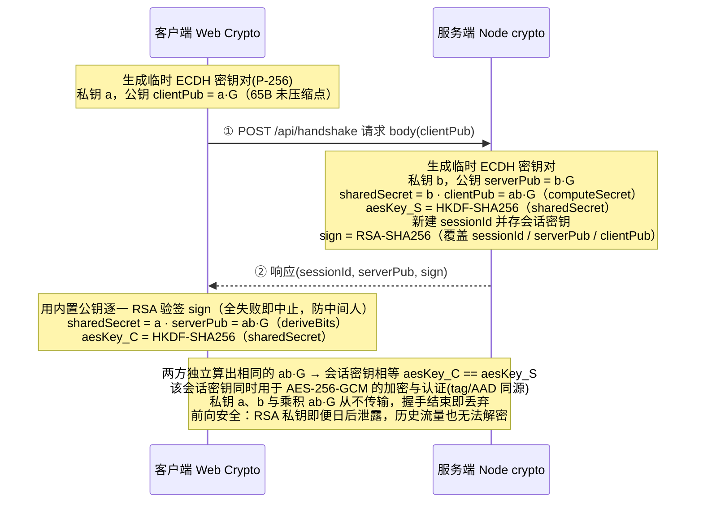

# API 加密方案 · 流程图

本文件用 Mermaid 流程图完整刻画 **HTTPS + ECDHE 密钥协商 + AES-256-GCM 认证加密 + 时间戳/nonce 防重放** 的端到端流程,所有步骤、字段、错误码均与源码逐行对齐。

> 渲染:VSCode(装 Markdown Preview Mermaid Support)/ GitHub / Typora 均可直接预览。

源码索引:

| 阶段 | 后端 | 前端 |
|---|---|---|
| 内置信任锚 | —(公钥不入库,构建期由 [key-gen.js](../scripts/key-gen.js) 写入) | [keys.json](../client/src/keys.json) / [http.js](../client/src/api/http.js) `initSecureChannel` |
| ECDHE 握手 | [routes/handshake.js](../server/src/routes/handshake.js) | [utils/ecdh.js](../client/src/utils/ecdh.js) `performHandshake` |
| 加解密中间件 | [middleware/secure.js](../server/src/middleware/secure.js) | [api/http.js](../client/src/api/http.js) 拦截器 |
| 密码学原语 | [utils/crypto.js](../server/src/utils/crypto.js) | [utils/crypto.js](../client/src/utils/crypto.js) |

---

## 图 1 · 全链路时序图(从启动到业务请求)

```mermaid
sequenceDiagram
    autonumber
    participant C as 前端 Vue (Axios)
    participant H as /api/handshake
    participant S as /api/secure/* (中间件)
    participant B as 业务路由 (login/profile)

    Note over C: 页面启动 → initSecureChannel()<br/>信任锚 = client/src/keys.json 内置公钥(构建期注入,运行时不取)

    rect rgb(52, 40, 62)
    Note over C,H: 阶段 ① ECDHE 握手(明文,HTTPS 保护)
    Note over C: 1) Web Crypto generateKey ECDH P-256<br/>2) exportKey 'raw' → clientPub (65B 未压缩点) base64
    C->>H: POST body(clientPub)
    Note over H: generateEcdhKeyPair → serverPub<br/>dh.computeSecret(clientPub) → sharedSecret<br/>HKDF-SHA256(sharedSecret) → 32B aesKey<br/>sessions.create(aesKey) → sessionId<br/>signHandshake: RSA-SHA256("sid\nserverPub\nclientPub")
    H-->>C: 响应(sessionId, serverPub, sign)
    Note over C: 4) 用内置公钥逐一 rsaVerify 签名串 sid/serverPub/clientPub<br/>   任一通过即可(支持轮换多公钥),全失败则中止(防中间人)<br/>5) ECDH deriveBits(serverPub, 私钥, 256)<br/>6) HKDF(salt, info) → aesKeyBytes
    Note over C: 保存 session(sessionId, aesKeyBytes)
    end

    rect rgb(40, 62, 52)
    Note over C,S: 阶段 ② 加密业务(每次全密文)
    Note over C: 请求拦截器 encryptRequestEcdhe:<br/>iv=random(12B), encryptedData=AES-256-GCM(明文)<br/>AAD="sid\nts\nnonce", tag=GCM认证标签<br/>timestamp=Date.now(), nonce=random(16B)hex
    C->>S: POST body(sessionId, timestamp, nonce, iv, encryptedData, tag)
    S->>S: 字段齐全 → 防重放 → 取会话密钥 → GCM 解密(tag 校验完整性)
    S->>B: req.body = 明文业务参数
    B-->>S: res.json(plainResult)
    Note over S: 包装 res.json 出站加密:<br/>respIv=random(12B), enc+tag=AES-GCM(plainResult)
    S-->>C: 响应(encryptedData, iv, tag)
    Note over C: 响应拦截器 decryptResponse:<br/>GCM 解密(tag 校验)→ JSON.parse<br/>失败 → 抛 "GCM 认证失败"
    end

    rect rgb(62, 52, 40)
    Note over C,S: 阶段 ③ 后续业务复用同一会话密钥
    C->>S: POST /api/secure/profile (同样加密套件)
    Note over C,S: nonce 必须不同 → 否则 403 NONCE_REUSED
    end
```



---

## 图 2 · 服务端 secure 中间件决策流程(含所有错误分支)

对应 [server/src/middleware/secure.js](../server/src/middleware/secure.js):**字段齐全 → 防重放 → 取会话密钥 → AES-GCM 解密(含 tag 完整性校验)→ 业务 → 出站加密**。

> 相比旧版,完整性校验并入 GCM 解密一步完成,不再有独立的 HMAC 验签环节。



---

## 图 3 · 客户端握手 + Axios 拦截器流程

对应 [client/src/utils/ecdh.js](../client/src/utils/ecdh.js) 与 [client/src/api/http.js](../client/src/api/http.js)。业务层完全无感知。



---

## 图 4 · ECDHE 密钥协商细节(前向安全性的来源)

下图展示一次 **`POST /api/handshake`** 往返内完成的密钥协商(请求带 `clientPub`,响应回 `sessionId / serverPub / sign`)。即便服务端 RSA 私钥日后泄露,历史流量也无法解密——因为每次会话对称密钥由**临时** ECDH 协商,密钥从不传输,握手结束即丢弃。



---

## 附录 A · 算法约定与常量(前后端必须逐字节对齐)

| 用途 | 算法 | 关键参数 |
|---|---|---|
| 数据加密 + 防篡改 | AES-256-GCM(AEAD) | nonce = 12B 随机;tag = 16B;密钥 = 会话 32B |
| 密钥协商 | ECDH P-256 | 公钥 raw = 未压缩点 65B;deriveBits 256bit |
| 密钥派生 | HKDF-SHA256 | `salt = api-encryption-demo-salt`,`info = aes-256-session-key`,输出 32B |
| 握手认证 | RSA-2048 + SHA-256 (PKCS#1 v1.5) | 签名串 = `sessionId\nserverPub\nclientPub` |
| 元数据绑定 | GCM AAD(请求方向) | `sessionId\ntimestamp\nnonce`(响应方向无 AAD) |
| 防重放 | timestamp + nonce | timestamp 偏差 5min;nonce TTL 5min 内唯一 |

### AAD / 签名串顺序(**不可更改**,改了就验不过)

```
请求方向 GCM AAD:  sessionId \n timestamp \n nonce
握手签名(RSA):     sessionId \n serverPub \n clientPub
响应方向:          (无 AAD)
```

> 请求/响应的加密与完整性校验密钥均为 ECDHE 协商出的**会话密钥**,不再使用任何全局共享 secret——因此前端无需硬编码任何密钥。

## 附录 B · 错误码汇总

| 错误码 | HTTP | 触发条件 | 抛出位置 |
|---|---|---|---|
| `BAD_REQUEST` | 400 | 缺少 6 个加密字段之一 | secure.js 字段校验 |
| `TIMESTAMP_EXPIRED` | 403 | timestamp 偏差 > 5min | replay.js |
| `NONCE_REUSED` | 403 | nonce 在 5min TTL 内重复 | replay.js |
| `SESSION_EXPIRED` | 403 | sessionId 不存在/已过期 | sessions.js |
| `AES_DECRYPT_FAIL` | 400 | GCM tag 校验失败 / 解密 / JSON.parse 失败 | secure.js 解密 |
| `HANDSHAKE_FAIL` | 400 | clientPub 格式非法 / computeSecret 失败 | handshake.js |
| —(抛异常) | — | 客户端 RSA 验签失败 / 响应 GCM 校验失败 | ecdh.js / crypto.js |

> 旧版的 `401 BAD_SIGN`(独立 HMAC 验签失败)已移除:完整性校验由 GCM 的 tag 承担,篡改密文/tag/AAD 统一归入 `400 AES_DECRYPT_FAIL`。
